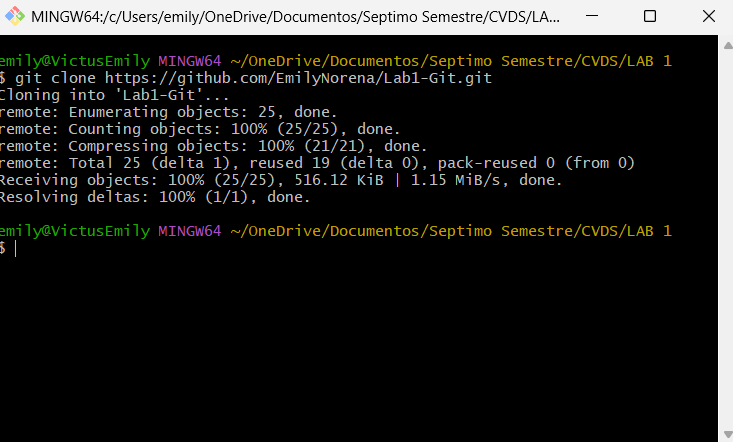
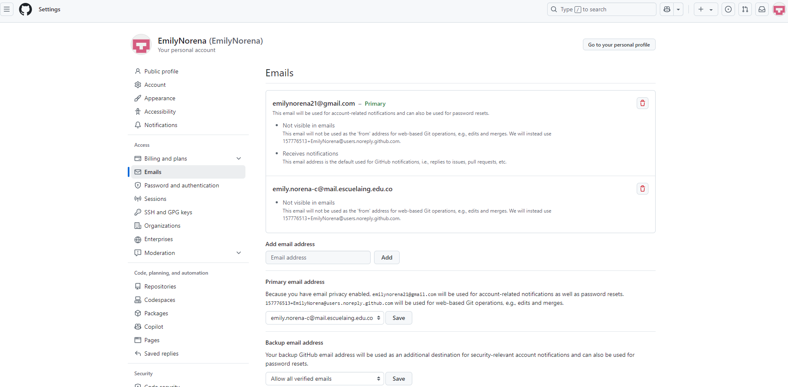
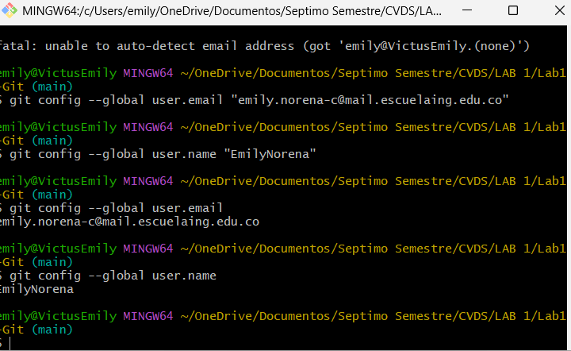
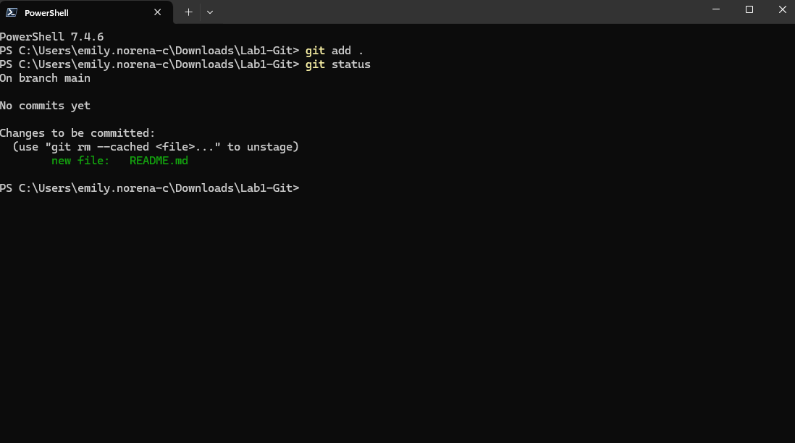
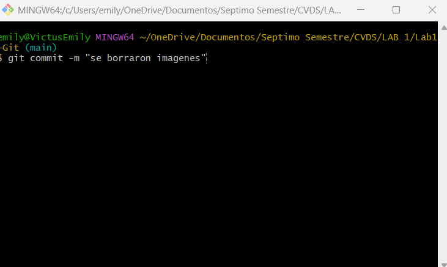

### Nombre: Emily Noreña Cardozo
### Respuestas
---
Para crear un repositorio local y configurarlo con uno remoto, creamos en primer lugar un repositorio remoto y lo clonamos en nuestro equipo local.

  

**git add:** Su función es decirle a git que debe rastrear los cambios realizados en un archivo en particular. Es útil cuando no es necesario realizar un seguimiento de todos los cambios en todos los archivos del índice en cada confirmación.
Usos más comunes:
- git add < path >: Organizar un directorio o archivo específico
- git add -A: Preparar todos los archivos (que no están listados en .gitignore) en todo el repositorio
- git add -p: Organizar interactivamente montones de cambios

**git commit -m "mensaje":** Funciona como un botón de guardar. Hasta ese momento, todos los cambios desde la última confirmación aún están "escalonados" y aún no están escritos permanentemente en el repositorio local de git. Este comando le dice a git que almacene permanentemente los cambios realizados en los archivos que seleccionó usando git add como nodo en el árbol git.

git commit - m establece un mensaje para el commit.

### Configuración del correo remoto y local

  

<figcaption>Enlace remoto con el correo institucional.</figcaption>

---

  

<figcaption>Enlace local con el correo institucional.</figcaption>

### Cambios hechos desde el repositorio local hacia el repositorio remoto
1. Debido a que creamos un repositorio remoto en blanco, localmente creamos un archivo readme.md y lo añadimos al repositorio remoto.
  

   

<figcaption>Añadimos el archivo readme.</figcaption>

2. Realizamos el paso anterior pero ahora con la carpeta assets, que contiene las imagenes del archivo readme.

3. Ya que habian imagenes repetidas en la carpeta assets, borramos dichas imagenes localmente e hicimos un commit para que se viera reflejado en el repositorio remoto.

  

